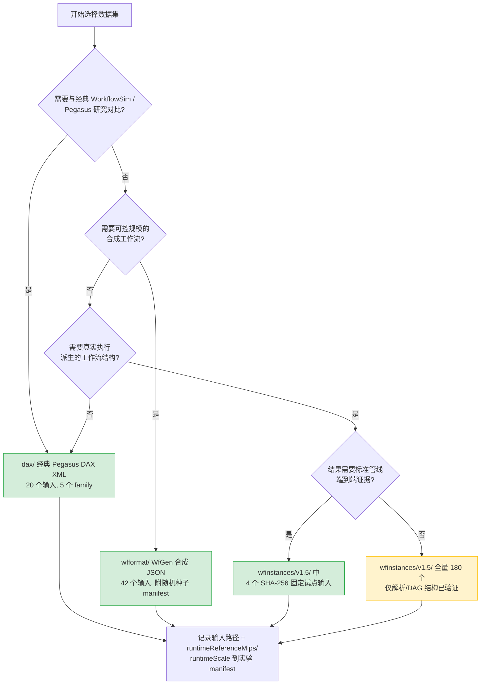

# 数据集选择快速指南

> 本指南帮助研究者在 `datasets/` 的三个集合中快速选出适合自己实验的输入。
> 各集合的来源、目录布局和完整字段契约见 [`datasets/README.md`](../../datasets/README.md)。

---

## 1. 决策流程图



---

## 2. 三个集合一览

| 集合 | 格式 | 数量 | 来源性质 | 验证等级 | 典型用途 |
|------|------|-----:|----------|----------|----------|
| `dax/` | Pegasus DAX 2.1 XML | 20 | Bharathi et al. 2008 经典表征 | 全部端到端可用（P7 基线覆盖） | 与既有 WorkflowSim / 调度文献做受控比较 |
| `wfformat/` | WfGen WfFormat JSON | 42 | 合成 profile（分布学习生成） | 全部解析验证 + 独立交叉对账 | 可控规模扫描（100/400/1000）、消融实验 |
| `wfinstances/v1.5/` | WfFormat JSON | 180 | 真实执行派生（上游语料快照） | 仅解析/DAG 结构验证；**只有 4 个试点完成端到端认证** | 真实结构多样性研究（需自行声明证据边界） |

**重要：** 三个集合来源不同，实验报告**不得**将它们混为一个 workload population。

---

## 3. 按研究场景选择

### 场景 A：调度算法基准对比（推荐起点）

**选择：** `dax/` 经典五大工作流

| family | 应用领域 | 可用规模 |
|--------|----------|----------|
| `cybershake` | 地震危险性 | 30 / 50 / 100 / 1000 |
| `epigenomics` | 生物信息 | 24 / 46 / 100 / 997 |
| `inspiral` | 引力波 (LIGO) | 30 / 50 / 100 / 1000 |
| `montage` | 天文图像拼接 | 25 / 50 / 100 / 1000 |
| `sipht` | sRNA 预测 | 30 / 60 / 100 / 1000 |

```text
路径模式: datasets/dax/<family>/n<tasks>/<Family>_<tasks>.dax
示例:     datasets/dax/montage/n100/Montage_100.dax
```

**理由：** 文献可比性最强；P7 冻结参考基线（20-cell matrix）覆盖全部 20 个输入，可直接对照 [`P7_RESULTS.md`](../experiments/reference-baselines/P7_RESULTS.md)。

**注意：** `epigenomics/n997` 是负值修复版，来源审计见 `datasets/README.md` 的"已知数据瑕疵与修复"。

---

### 场景 B：规模敏感性 / 消融实验

**选择：** `wfformat/` WfGen 合成实例

| recipe | 领域 | 可用规模 |
|--------|------|----------|
| `montage` | 天文 | 100 / 400 / 1000 |
| `epigenomics` | 生物信息 | 100 / 400 / 1000 |
| `blast` | 生物信息 | 100 / 400 / 1000 |
| `1000genome` | 生物信息 | 100 / 400 / 1000 |
| `seismology` | 地震学 | 400 / 1000 |

```text
路径模式: datasets/wfformat/<recipe>/n<tasks>/<recipe>-<tasks>-<idx>.json
示例:     datasets/wfformat/blast/n400/blast-400-000.json
```

**理由：**
- 规模分档统一（小 100 / 中 400 / 大 1000），适合规模扫描
- 每个实例附同名 `.manifest.json`（recipe、随机种子、缩放因子），可复现生成过程
- 同一 recipe 多个实例（`-000`、`-001`……），支持跨实例统计

**注意：** 这些是合成 profile，不是真实执行测量；结论应表述为"在 WfGen 合成负载下"。

---

### 场景 C：真实执行派生结构研究

**选择：** `wfinstances/v1.5/`（谨慎使用）

```text
路径模式: datasets/wfinstances/v1.5/<runtime-system>/<application>/<instance>.json
示例:     datasets/wfinstances/v1.5/makeflow/blast/blast-chameleon-small-001.json
```

| 来源系统 | 输入数 | 应用 |
|----------|-------:|------|
| Makeflow | 30 | BLAST、BWA |
| Nextflow | 15 | nf-core pipelines |
| Pegasus | 135 | 1000Genome、Cycles、Epigenomics、Montage、Seismology、SoyKB、SRaSearch |

**证据边界（务必写入论文）：**
- ✅ 180 个文件全部通过解析/DAG 结构验证（`files=180, tasks=118637, edges=244573`）
- ✅ 仅 **4 个 SHA-256 固定试点输入**完成标准管线端到端认证（见 [`WFINSTANCES_PILOT.md`](../advanced/WFINSTANCES_PILOT.md)）
- ❌ 本模拟器**不做** trace replay，不重放来源平台，不预测其 observed makespan
- ❌ 不得声称"在真实生产负载上验证了算法性能"

---

### 场景 D：跨数据源对照

`montage` 和 `epigenomics` 同时存在于 `dax/` 与 `wfformat/`，可做**受控的数据源对照**（同应用、不同来源表征）。

**限制：** 这种对照不可延伸为 WfInstances trace replay，也不可无条件合并跨来源工作负载做统计。

---

## 4. 使用前检查清单

- [ ] **路径约定**：P7/研究驱动需要 `datasets/` 目录的**绝对路径**；历史示例用相对于项目根的 `datasets/...` 路径。两者不可混用。
- [ ] **runtime 转换假设**：所有输入的 runtime（秒）按 `max(100, floor(runtimeSeconds × runtimeReferenceMips × runtimeScale))` 转为 CloudSim MI（默认 `runtimeReferenceMips=1000.0`、`runtimeScale=1.0`）。这两个值必须随实验结果记录。
- [ ] **索引核对**：`dax/INDEX.json` 和 `wfformat/INDEX.json` 是权威清单；`wfinstances/v1.5/` 无本项目索引，按上游目录组织。
- [ ] **证据声明**：论文/报告中按上表"验证等级"如实描述所用集合的证据范围。
- [ ] **可复现记录**：manifest.json 中记录输入路径（及 WfInstances 试点的 SHA-256）。

---

## 5. 快速验证命令

```bash
# 单个 WfFormat 输入试运行（实验模块示例）
mvn -pl :workflowsim-experiments -am \
  -Dexec.mainClass=org.workflowsim.examples.wfcommons.WfCommonsSimulationExample1 \
  -Dexec.args="datasets/wfformat/montage/n100/montage-100-000.json" \
  compile exec:java

# 校验整个 WfInstances 语料（解析/DAG 结构）
mvn -pl :workflowsim-experiments -am -DskipTests \
  -Dexec.mainClass=org.workflowsim.examples.wfcommons.WfCommonsJsonParserValidationExample \
  -Dexec.args="datasets/wfinstances/v1.5" \
  compile exec:java
```

---

## 6. 相关文档

- [`datasets/README.md`](../../datasets/README.md) — 数据集完整说明（来源、目录、字段契约、已知瑕疵）
- [`WFINSTANCES_PILOT.md`](../advanced/WFINSTANCES_PILOT.md) — WfInstances 四个试点的认证与不可主张范围
- [`P7_RESULTS.md`](../experiments/reference-baselines/P7_RESULTS.md) — P7 冻结参考基线结果
- [`BUILD.md`](BUILD.md) — 构建命令速查表
- [`LEGACY_MIGRATION.md`](../algorithms/LEGACY_MIGRATION.md) — 遗留算法迁移指南
